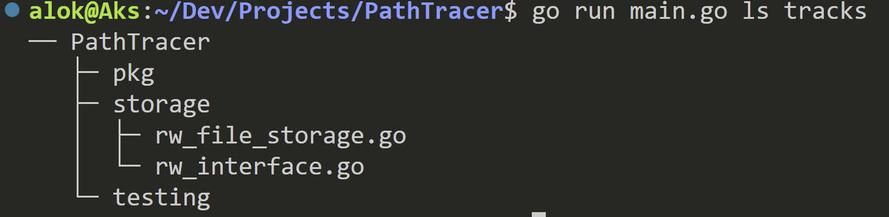

# MetaManager/PathTracer

### Use

- Create and manage custom metadata for any kind of tree structure (dir structure in this case)
- Track and untrack any subtree i.e., any file/directory/all-content-in-a-dir
- Add tags to the any node (i.e., file/dir)
    - Search all nodes with a tag
    - List all tags of a node
- Add unique ids to a node (i.e., file/dir)
    - Quickly find nodes with an id in a dir structure
- See the tracked directory structure (with/without tags/id) as a tree

### How to use?

- Use --help command to get the list of commands and how to use it

### Examples:

- Use ls to list all the tracked nodes

